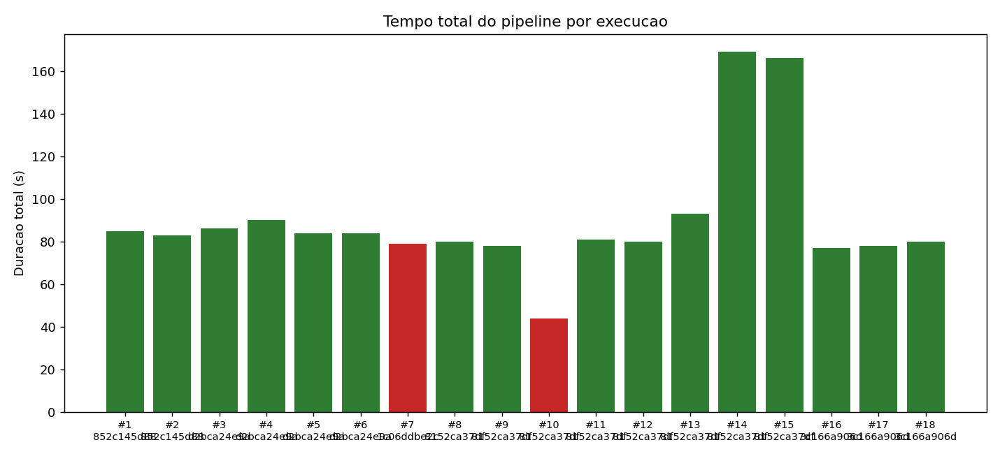
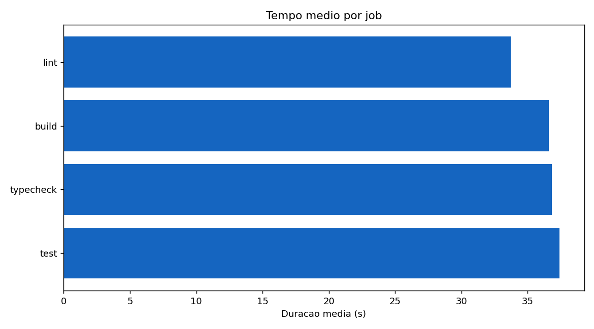
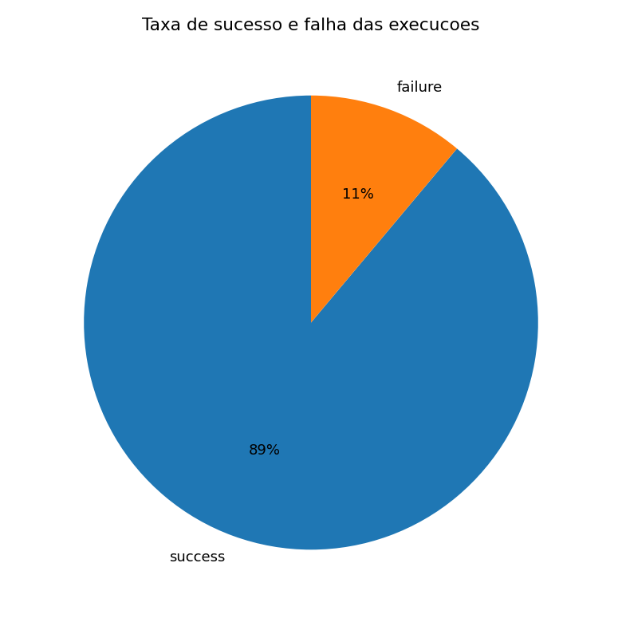
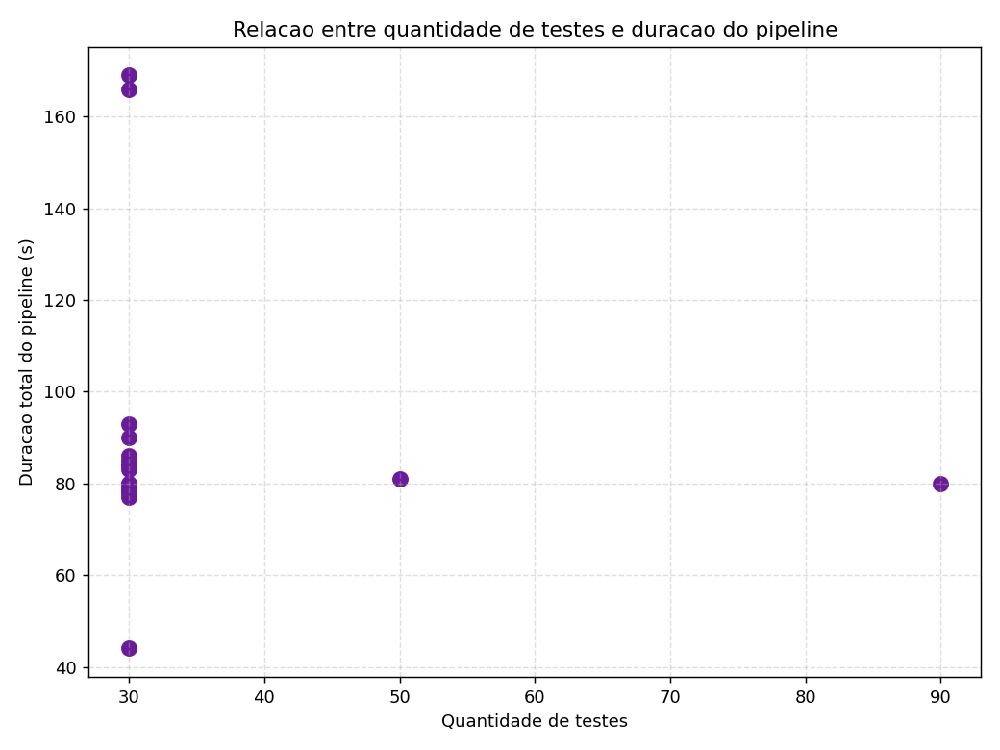

# Relatório técnico: experimento de instrumentação de pipeline CI/CD

**Autora:** Larissa Temóteo
**Repositório:** https://github.com/larissatemoteo/cicd-pipeline-metrics-lab

## 1. Visão geral do experimento

O experimento instrumenta um pipeline CI/CD real no GitHub Actions, coleta métricas via API, organiza os dados em base estruturada, gera gráficos e analisa desempenho, estabilidade e gargalos. O projeto-alvo é um módulo Python (`datalab`) que usa pandas, numpy, scipy e scikit-learn, com testes em pytest. As dependências pesadas são propositais: garantem que a instalação tenha custo real e que cache e paralelismo sejam mensuráveis acima do ruído do runner. O pipeline cumpre as cinco etapas em quatro jobs (lint, typecheck, test, build): instalação de dependências, análise estática (ruff), type check (mypy), testes (pytest com JUnit), geração de artefato e coleta de métricas. Há dois workflows com a mesma carga: `ci-parallel.yml` (paralelo) e `cdo via `needs`), para isolar o paralelismo.

## 2. Evidências de execução real

- Workflow paralelo: https://github.com/larissatemoteo/cicd-pipeline-metrics-lab/blob/main/.github/workflows/ci-parallel.yml
- Workflow sequencial: https://github.com/larissatemoteo/cicd-pipeline-metrics-lab/blob/main/.github/workflows/ci-sequential.yml
- Execuções: https://github.com/larissatemoteo/cicd-pipeline-metrics-lab/actions

18 runs reais executadas:

| Run ID | Variação | Workflow | Testes | Status | Duração (s) |
|--------|----------|----------|--------|--------|-------------|
| [26890773247](https://github.com/larissatemoteo/cicd-pipeline-metrics-lab/actions/runs/26890773247) | baseline (cache on) | Parallel | 30 | success | 85 |
| [27111075820](https://github.com/larissatemoteo/cicd-pipeline-metrics-lab/actions/runs/27111075820) | sem cache | Parallel | 30 | success | 83 |
| [27111088259](https://github.com/larissatemoteo/cicd-pipeline-metrics-lab/actions/runs/27111088259) | baseline | Parallel | 30 | success | 86 |
| [27111094652](https://github.com/larissatemoteo/cicd-pipeline-metrics-lab/actions/runs/27111094652) | baseline | Parallel | 30 | success | 90 |
| [27111131368](https://github.com/larissatemoteo/cicd-pipeline-metrics-lab/actions/runs/27111131368) | baseline | Parallel | 30 | success | 84 |
| [27111168379](https://github.com/larissatemoteo/cicd-pipeline-metrics-lab/actions/runs/27111168379) | baseline | Parallel | 30 | success | 84 |
| [27111179702](https://github.com/larissatemoteo/cicd-pipeline-metrics-lab/actions/runs/27111179702) | falha de lint | Parallel | 30 | failure | 79 |
| [27111220647](https://github.com/larissatemoteo/cicd-pipeline-metrics-lab/actions/runs/27111220647) | b Parallel | 30 | success | 80 |
| [27111294367](https://github.com/larissatemoteo/cicd-pipeline-metrics-lab/actions/runs/27111294367) | sem cache | Parallel | 30 | success | 78 |
| [27111295107](https://github.com/larissatemoteo/cicd-pipeline-metrics-lab/actions/runs/27111295107) | falha de teste | Parallel | 30 | failure | 44 |
| [27111295730](https://github.com/larissatemoteo/cicd-pipeline-metrics-lab/actions/runs/27111295730) | scale 2 | Parallel | 50 | success | 81 |
| [27111296457](https://github.com/larissatemoteo/cicd-pipeline-metrics-lab/actions/runs/27111296457) | scale 4 | Parallel | 90 | success | 80 |
| [27111297230](https://github.com/larissatemoteo/cicd-pipeline-metrics-lab/actions/runs/27111297230) | teste lento | Parallel | 30 | success | 93 |
| [27111297990](https://github.com/larissatemoteo/cicd-pipeline-metrics-lab/actions/runs/27111297990) | sequencial | Sequential | 30 | success | 169 |
| [27111298701](https://github.com/larissatemoteo/cicd-pipeline-metrics-lab/actions/runs/27111298701) | sequencial | Sequential | 30 | success | 166 |
| [27111827535](https://github.com/larissatemoteo/cicd-pipeline-metrics-lab/actions/runs/27111827535) | baseline | Parallel | 30 | success | 77 |
| [27111832983](https://github.com/larissatemoteo/cicd-pipeline-metrics-lab/actions/runs/27111832983) | sem cache | Parallel | 30 | success | 78 |
| [27111833687](https://github.com/larissatemoteo/cicd-pipeline-metrics-lab/actions/runs/27111833687) | sem cache | Parallel | 30 | success | 80 |

Commits reais: `852c145` (estrutura), `d2bca24` (script), `1c06ddb` (falha de lint), `8152ca3` (revert), `3c166a9` (correção do cache).

## 3. Variações realizadas

Disparadas via `gh workflow run` com inputs controlados, e a falha de lint via commit real: baseline (30 testes, cache, paralelo); sem cache (`disable_cache=true`); aumento de testes (`test_scale=2` e `4`); teste lento (w_test=true`); falha de teste (`fail_test=true`); falha de lint (import não utilizado); sequencial (jobs encadeados).

## 4. Método de coleta

`scripts/collect_metrics.py` consulta a API REST do GitHub Actions: lê run, jobs e steps, calcula durações pela diferença entre `started_at` e `completed_at`, e baixa o artefato `test-results` para ler o resumo de testes (`pipeline-metrics.json`, gerado em CI por `scripts/summarize_tests.py`). Saída: `data/metrics.csv` (uma linha por job) e `data/steps.csv` (uma por step). Gráficos por `scripts/plot_metrics.py`. Nenhum valor digitado à mão.

## 5. Gráficos

## 6. Análise

**1. Etapa que mais pesa:** instalação de dependências, ~27s por job, contra ~3,7smypy e ~3,9s do build. O tempo é dominado pela preparação do ambiente.

**2. Diferença com e sem cache:** não significativa. Instalação ~28s sem cache vs ~27s com (1 a 2s); no tempo de parede some no ruído. O gargalo é descompactar os pacotes pesados, não baixá-los, e o cache só economiza o download.

**3. Paralelismo:** reduziu de ~167s (sequencial) para ~84s (paralelo), quase metade. Condição: jobs independentes (lint, typecheck, test) rodam juntos; o build depende do test e não paraleliza com ele.

**4. Falhas mais frequentes:** dois tipos, uma cada (teste e lint). A falha de teste encerrou em 44s (build pulado); a de lint levou ~79s normais.

**5. Feedback rápido?** ~84s no paralelo é adequado; ~167s no sequencial já é lento. O atraso vem da instalação, não dos testes.

**6. Melhorias:** cachear o ambiente instalado (não só o download); não instalar deps pesadas em jobs que não precisam (lint só precisa do ruff); manter jobs em paralelo.

**7. Limitações dos dados:** amostrar no tempo de parede; tempo de parede difere do faturado; métricas de teste repetidas por linha de job; execuções via dispatch compartilham commit; cache compartilhado entre runs; um único runner.

**8. Apoio a decisões:** direciona a otimização para a instalação, confirma o valor do paralelismo, e mostra que o cache do pip não compensa aqui, permitindo simplificar o workflow.

## 7. Resultados inesperados

**1. O cache quase não ajudou** (1 a 2s), porque o gargalo é descompactar pacotes, não baixá-los. **2. Triplicar os testes (30 para 90) não mudou a duração** (~80s), porque os testes são rápidos e a instalação domina. Mesma raiz: o tempo é governado pela preparação do ambiente.

## 8. Hipótese inicial x resultado observado

| Variação | Hipótese | Observado |
|----------|----------|-----------|
| Sem cache | Bem mais lenta | 1 a 2s, sem efeito prático |
| Paralelismo | Reduziria o total | Reduziu para ~metade (84s vs 167s) |
| Aumento de testes | Cresceria com o nº de testes
| Teste lento | Aumentaria o job de teste | Aumentou conforme a espera |
| Falha de teste | Marcaria como falha | Falhou e encurtou (build pulado) |

## 9. Limitações do experimento

Runners compartilhados do GitHub têm variação fora de controle. A variação de cada run foi identificada pela assinatura nos dados (nº de testes, etapa pulada, job que falhou), não por metadado de input. Aprendizado metodológico: detectar execuções sem cache pela presença da etapa falha, pois etapas puladas continuam listadas com conclusão "skipped"; o correto é usar a conclusão, reforçando a importância de validar que cada variação surtiu efeito antes de concluir.

## 10. Como reproduzir

1. Clonar, criar ambiente (`python -m venv .venv`, ativar) e `pip install -r requirements.txt -r requirements-dev.txt`.
2. Disparar execuções: `./scripts/run_experiment.sh` (com `gh` autenticado) e um commit com import não utilizado para a falha de lint.
3. Coletar: `export GITHUB_TOKEN=$(gh auth token)` e `python scrip-repo <usuario>/cicd-pipeline-metrics-lab`.
4. Gráficos: `python scripts/plot_metrics.py`.
